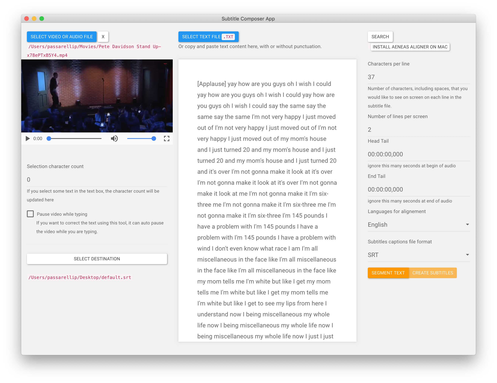

# Introduction

User manual for`Subtitle Composer App` a fast Max OS X app for generating subtitles from plain text files, that do not have time-codes\).

If you have any issues, thoughts, questions, or ideas feel free to get in touch with [Pietro](http://twitter.com/pietropassarell).

For developers [see github repo](https://github.com/pietrop/subtitlesComposer-app), PR welcome.

