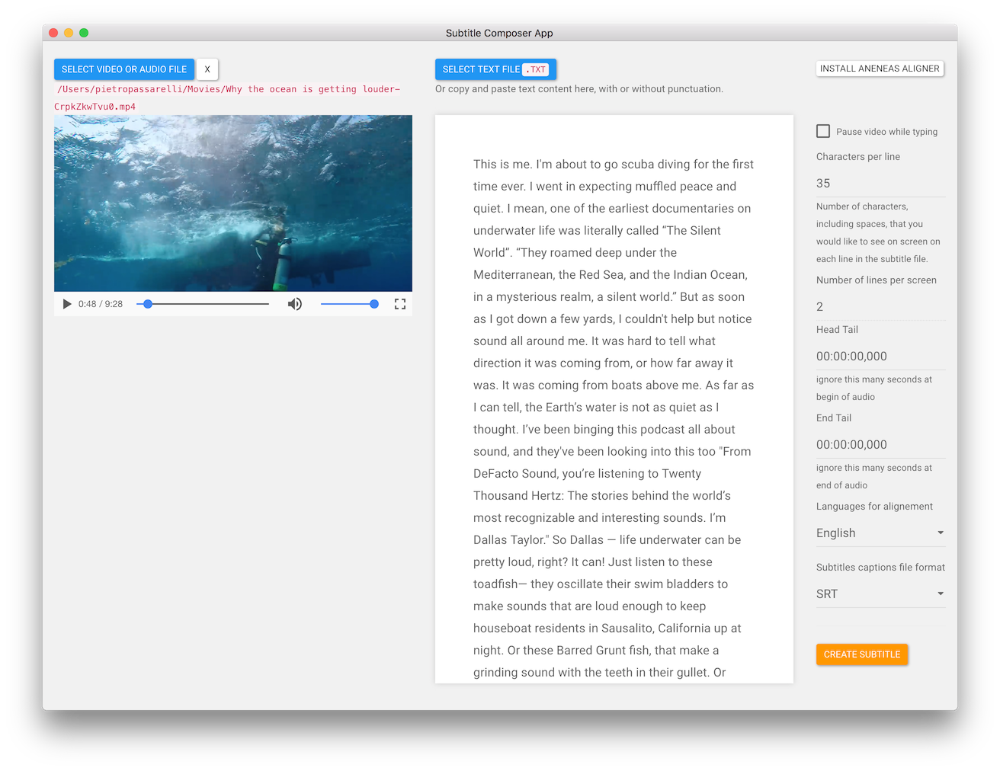

# Adding Text

There a few options for this

1. you click on the button above the text area and click `select text file` and add a `.txt` file to the app.
2. you copy and paste from another source, eg a word document etc, directly into the app text area.
3. you can play the video and type the text yourself.

Side note, you can use auto mated system to get a first drafr of the text such as

* [autoEdit](http://www.autoedit.io/) - [see user manual](https://pietropassarelli.gitbooks.io/autoedit2-user-manual/content/transcribing.html) is a fast text based video editing app for os x, that can also be used to get automated transcriptions from IBM Watson to use as a first draft.
* [Video downloader app](https://github.com/pietrop/electron-video-downloader/releases) to get automated captions from youtube to use as a first draft.
* Others...

Note: The text does not need to have punctuation for the app to generate the caption file.

But if punctuation is provided the app will use it to make more informed judgement calls on when to break words onto a new line.

