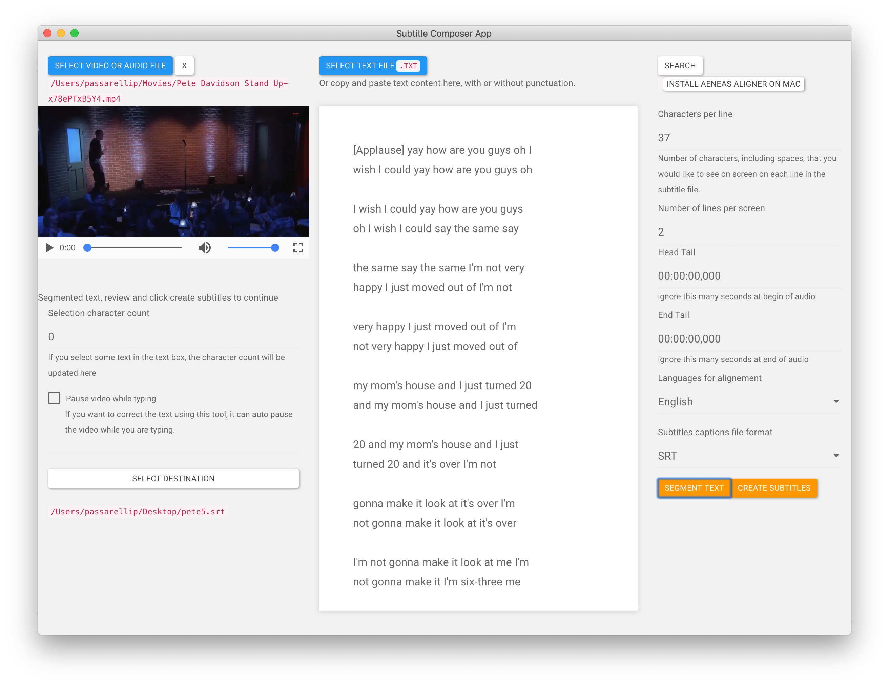
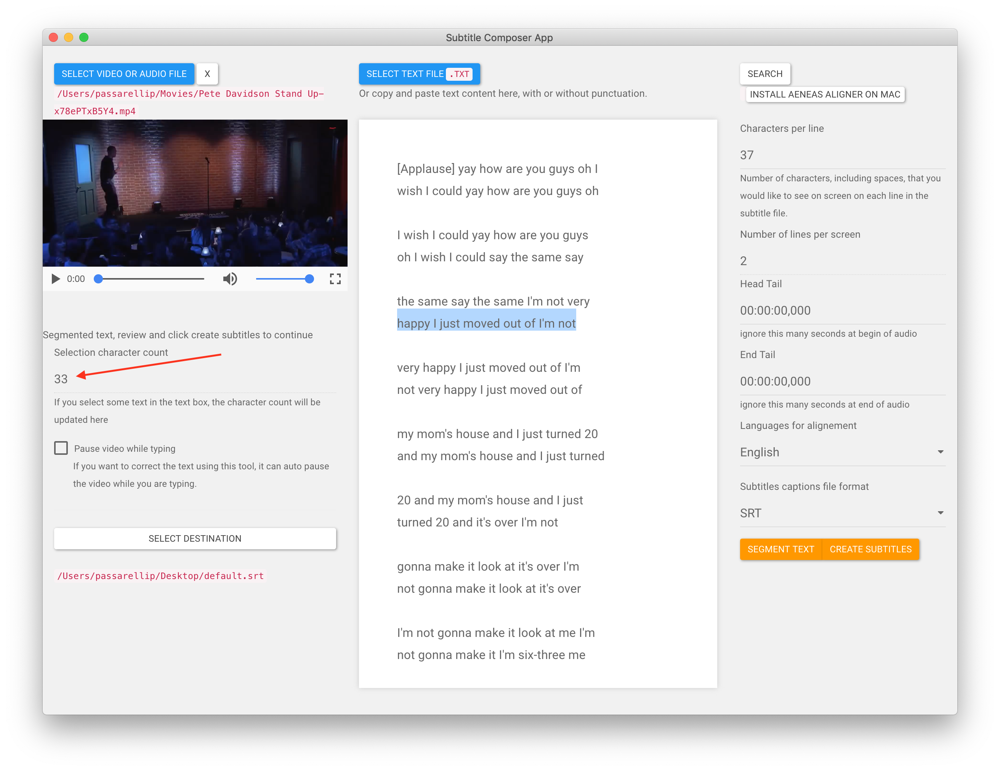
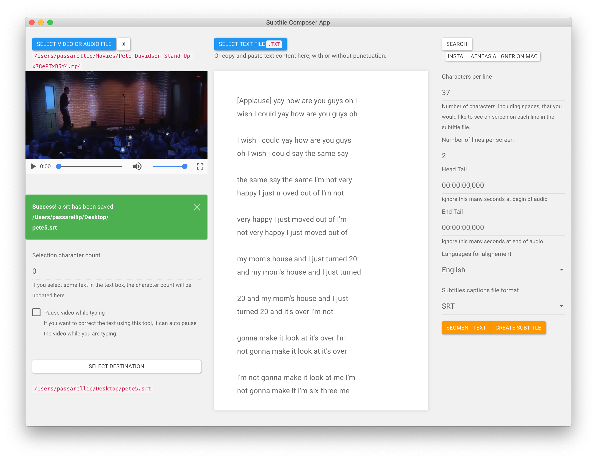

# Generating captions


The key idea is to use an _optional_ pre-segmentation review step. To make it easier to adjust the captions segmentation before generating the file.


1.[Add text file ](../adding-text/)and [audio file](../opening-a-video-or-audio-file.md#click-on-select-video-or-audio-file) \(select the text file, don't copy and paste for now\)

2.Click `segment text` button

3.Review text segments. You can readjust the segmentation by editing the text in free form.

4.Optional - If useful, you can select some text and get character count.

Eg if you want to check a line is still within eg 37 character limit while adjusting the text and line breaks.

5.When done click `create subtitles`

6.Subtitle file will be on your desktop, and you can import that in premiere. To use as caption track.

7.Optional, If need you can repeat from step 3 to review and adjust the segments and re generate an srt caption file to add to premiere.

