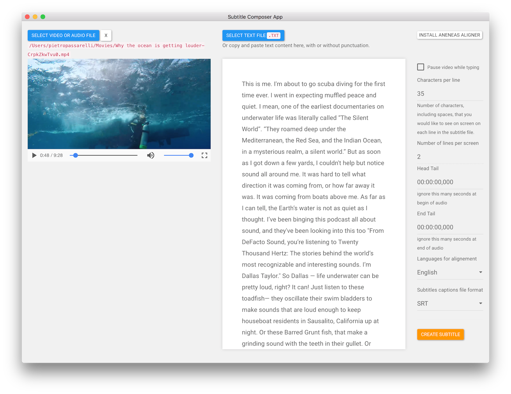

# Captions Settings

The app provides some of the customization option originally available via Aeneas, and it does a bit of prep on the text to get it ready for alignement.

Such as

* How many characters including spaces are on each line, 35 is default
* always tries to have two lines of text on screen at any given time.
* Allows to ignore some time at the beginning and at the end of the clip. Eg if there is teaser/credits/music etc..
* can chose between a variety of languages to align and create captions from.

> Confirmed working on 38 languages: AFR, ARA, BUL, CAT, CYM, CES, DAN, DEU, ELL, ENG, EPO, EST, FAS, FIN, FRA, GLE, GRC, HRV, HUN, ISL, ITA, JPN, LAT, LAV, LIT, NLD, NOR, RON, RUS, POL, POR, SLK, SPA, SRP, SWA, SWE, TUR, UKR

[From Aeneas documentation](https://github.com/readbeyond/aeneas#supported-features)

* Can chose from a list of supported subtitles/captions file formats.

  > Output sync map formats: AUD, CSV, EAF, JSON, SMIL, SRT, SSV, SUB, TEXTGRID, TSV, TTML, TXT, VTT, XML [From Aeneas documentation for a comprehensive list of supported file formats](https://github.com/readbeyond/aeneas#supported-features)

