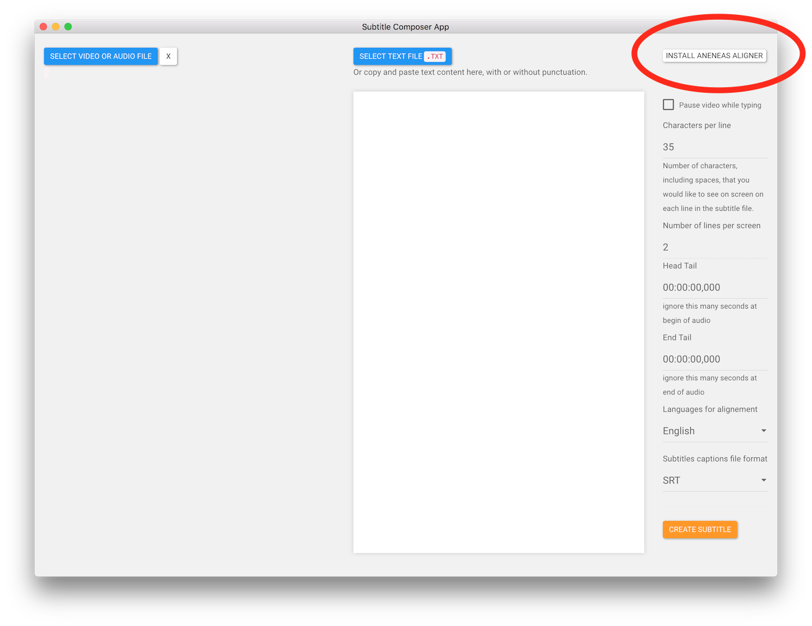

# Installing

## Download 

Download the latest stable release from the [releases page](https://github.com/pietrop/subtitlesComposer-app/releases). Check out the release description to see what has changed from the previous version.

* download the `dmg` file
* open it/mount it on your mac/finder
* drag the app into the applications folder
  * First time you open it, right click on the app and click open, to avoid the `unidentified developer` error message. From then on, you can double click.
* add it to the dock if you want a shortcut to it.

### `unidentified developer` 

if you get the`unidentified developer`error follow [these instructions](https://support.apple.com/kb/ph18657?locale=en_US)

## Extra dependency: Aeneas

[Aeneas](https://github.com/readbeyond/aeneas) is an open source tool that is used by this app under the hood to do the alignment.

**In order to use the app you need to install Aeneas on your computer.**

You can install it for [mac os x by downloading the `dmg` from this link](https://github.com/sillsdev/aeneas-installer/releases).

At a very high level under the hood Aeneas converts the text of the provided transcription into speech \(`TTS`\) and compares the waveform with the one of the original media \(audio or video\) to do the alignment.

